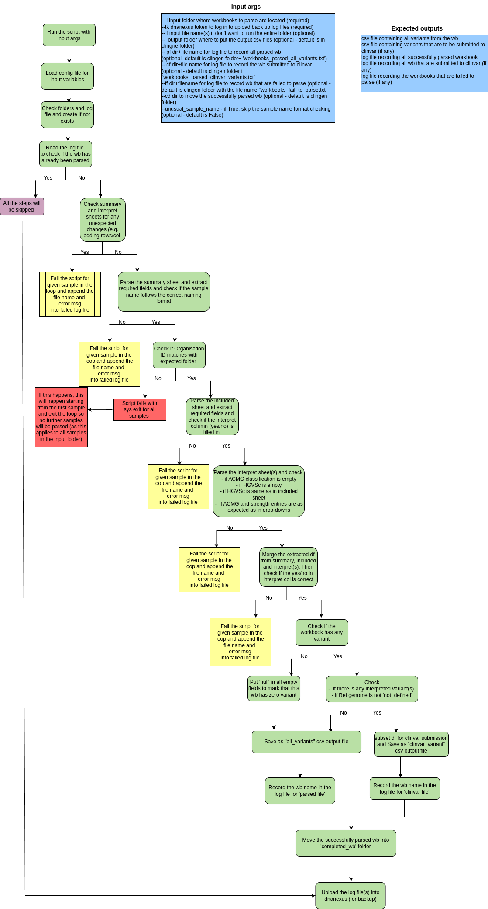

# variant_workbook_parser.py

## What does this script do?

This script parses the sheets in variant workbook(s) and extract fields required to submit to Variant Database and Clinvar.

## What are typical use cases for this script?

This script may be executed as a standalone to parse the variant workbook(s).

## What data are required for this script to run?

**Packages**

* Python packages (specified in requirements.txt)

**File inputs (required)**:

- `--indir` / `--i`: directory for input file(s)

**Other Inputs (optional):**

- `--outdir` / `--o`: dir where the output csv files are saved. Default is //clingen/cg/Regional Genetics Laboratories/Bioinformatics/clinvar_submission/Output/ and keep as default unless necessary to change.
- `--file` / `--f` : workbook if want to specify; if not specify, the script will take all xlxs file in the `--indir`. 
- `--parsed_file_log` / `--pf` : log file to record the parsed workbook. Default is //clingen/cg/Regional Genetics Laboratories/Bioinformatics/clinvar_submission/Output/workbooks_parsed_all_variants.txt and keep as default unless necessary to change.
- `--clinvar_file_log` / `--cf` : log file to record the parsed workbook that are submitted to clinvar. Default is
//clingen/cg/Regional Genetics Laboratories/Bioinformatics/clinvar_submission/Output/workbooks_parsed_clinvar_variants.txt". Keep as default unless necessary to change
- `--failed_file_log` / `--ff` : log file to record the workbook that are failed to parse. Default is //clingen/cg/Regional Genetics Laboratories/Bioinformatics/clinvar_submission/Output/workbooks_fail_to_parse.txt. Keep as default unless necessary to change.
- `--completed_dir` / `--cd` : dir to where the successfully parsed workbook(s) are moved. Default is //clingen/cg/Regional Genetics Laboratories/Bioinformatics/clinvar_submission/Output/completed_wb/. Keep as default unless necessary to change.
- `--failed_dir` / `--fd` : dir to where the failed workbook(s) are moved. Default is //clingen/cg/Regional Genetics Laboratories/Bioinformatics/clinvar_submission/Output/failed_wb/. Keep as default unless necessary to change.
- `--unusual_sample_name`: boolean - default is False and the sample name in the workbook will be tested if it follows the standard naming format, and if the test fails, the workbook for that sample will not be parsed. Put this args to skip the test in samples with unusual naming format.
- `--no_dx_upload`: boolean - default is False and the logs and clinvar csvs are uploaded onto DNAnexus. Use this flag to skip dx uploading.
- `--subfolder` / `--sub` : str for subfolder name in Pandora DNAnexus project. Default is `csvs`
- `--token` / `--tk` : dnanexus token to login

## Configuration file (parser_config.json)
This sets some of the variables required for ClinVar submission. It also sets the folders for gathering workbooks and the DNAnexus project for uploading the CSVs.
Example config format:
```
{
    "config_information": {
        config_version": "1.1.0"
    },
    "info": {
        "CUH Organisation": "Cambridge Genomics Laboratory",
        "NUH Organisation": "Genomics and Molecular Medicine Service",
        "Institution": "East Genomic Laboratory Hub, NHS Genomic Medicine Service",
        "Collection method": "clinical testing",
        "Allele origin": "germline",
        "Affected status": "yes",
        "CUH folder": "CUH",
        "NUH folder": "NUH",
        "CUH org ID": 288359,
        "NUH org ID": 509428,
        "csv_projectID": "project-xxxx"
    }
}
```

## What outputs are expected from this script?
- csv file containing all variants from the workbook
- csv file containing interpreted variant(s) from the workbook for clinvar submission (optional)
- workbooks_fail_to_parse.txt (optional) - txt file containing the file(s) that fails to be parsed by parser script and reason for fail
- workbooks_parsed_all_variants.txt - txt file containing the file(s) that are successfully parsed 
- workbooks_parsed_clinvar_variants.txt (optional) - txt file containing the file(s) that are successfully parsed for clinvar submission


## Command line to run 
`python variant_workbook_parser.py --i </path/to/folder/> --f <file_name> --o </path/to/folder/> --pf </path/to/file/> --cf </path/to/file/> --fp </path/to/file/> --cd </path/to/folder/> --fd </path/to/folder/> --tk <DNAnexus token>`

Recommend to run as below so the all the output dir and files are directed to default

`python variant_workbook_parser.py --i </path/to/folder/> --tk <DNAnexus token>`



# get_completed_wb.py

## What does this script do?

This script searches file(s) for given sample(s) in clingen folder of Trust PC and copies these file(s) into another folder.

## What data are required for this script to run?

**File inputs (required)**:

- `--input` / `--i`: input file containing a list of verified workbooks 
- `--outdir` / `--o`: dir where to copy the verified workbooks 
- `--folder` / `--f`: dir where to search the verified workbooks
- `--file_not_found` / `--fnf` : log file to record the files that are not found. Default is //clingen/cg/Regional Genetics Laboratories/Bioinformatics/clinvar_submission/Output/workbooks_not_found_clingen.txt. Keep as default unless necessary to change.
## What outputs are expected from this app?
- found verified workbooks are copied into outdir
- workbooks_not_found_clingen.txt- log file containing the samples that are not found

## Command line to run 
```python get_completed_wb.py --i <txt_file_name>  --o </path/to/folder/> --f </path/to/folder> --fnf </path/to/log file>```